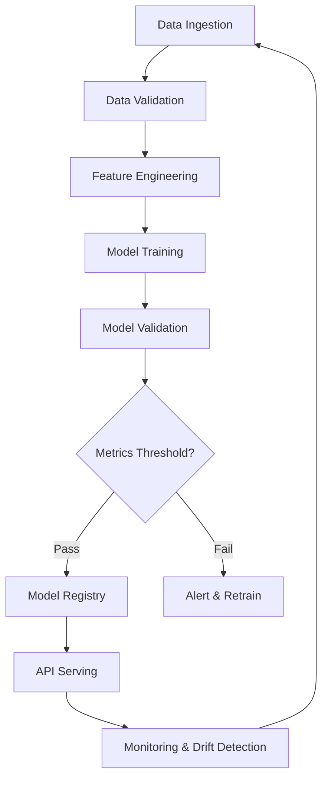

## Problem & Context

The California Housing dataset is a classic regression benchmark, but most tutorials stop at model training in a notebook. **Real ML engineering begins where notebooks end.** This project was built to demonstrate a complete, production-ready MLOps pipeline — from raw data ingestion through automated training, validation, versioning, and serving — using industry-standard tools and practices.

**Key challenges addressed:**
- Reproducible, automated training pipelines (not manual notebook runs)
- Model versioning and lineage tracking
- Automated quality gates before deployment
- Production API with monitoring and drift detection
- CI/CD for ML (not just code)

---

## Approach

I chose a **pipeline-as-code** approach using MLflow for experiment tracking and model registry, FastAPI for serving, and GitHub Actions for CI/CD. The architecture follows the principle that **every step should be automated, versioned, and auditable**.

**Why XGBoost?** For tabular data like housing prices, gradient boosting consistently outperforms neural networks while being faster to train, easier to interpret, and more robust to outliers. The California Housing dataset (20k samples, 8 features) is ideal for demonstrating MLOps without compute bottlenecks.

**Why FastAPI?** Automatic OpenAPI docs, async support, Pydantic validation, and excellent performance — all critical for production ML APIs.

---

## Architecture



**Component breakdown:**

| Stage | Tool | Purpose |
|-------|------|---------|
| Orchestration | GitHub Actions | CI/CD, scheduled retraining |
| Experiment Tracking | MLflow | Parameters, metrics, artifacts |
| Model Registry | MLflow | Versioning, stage transitions |
| Serving | FastAPI + Uvicorn | High-performance REST API |
| Validation | Great Expectations | Data quality checks |
| Monitoring | Evidently AI + Prometheus | Data drift, performance tracking |
| Containerization | Docker | Reproducible environments |

---

## Key Technical Decisions

### 1. MLflow for Experiment Tracking + Registry
**Decision:** Use MLflow as the central metadata store rather than a custom solution.
**Trade-off:** MLflow's UI is basic compared to managed platforms (Vertex AI, SageMaker), but it's open-source, self-hostable, and integrates natively with the training code.
**Outcome:** Full reproducibility — every run logs parameters, metrics, code version, and the serialized model. Model promotion from Staging → Production is a single API call.

### 2. Great Expectations for Data Validation
**Decision:** Validate data at pipeline entry, not just during training.
**Trade-off:** Adds pipeline latency (~30s), but catches schema drift, missing values, and distribution shifts before they corrupt model training.
**Outcome:** Pipeline fails fast on bad data. Validation suites versioned alongside code.

### 3. Automated Model Promotion Gates
**Decision:** Require R² ≥ 0.80 and RMSE ≤ 0.50 for auto-promotion to Staging.
**Trade-off:** Strict thresholds may block valid models during experimentation. Mitigated by manual override for edge cases.
**Outcome:** Production models always meet minimum quality bar. No "it worked on my machine" deployments.

### 4. Docker Multi-Stage Builds
**Decision:** Separate build, test, and runtime stages. Final image < 500MB.
**Trade-off:** Longer CI builds, but smaller attack surface and faster deployments.
**Outcome:** Consistent environments from laptop to production. GraalVM native image exploration for future optimization.

---

## Code Highlights

### Pipeline Definition (DAG)
```python
# pipelines/training_pipeline.py
from mlflow.projects import run

def training_pipeline(config: TrainingConfig) -> str:
    """Execute full training pipeline, return MLflow run ID."""
    with mlflow.start_run() as run:
        # 1. Load & validate data
        df = load_data(config.data_path)
        validate_data(df, config.expectation_suite)

        # 2. Feature engineering
        X_train, X_test, y_train, y_test = prepare_features(
            df, config.feature_config
        )

        # 3. Train with hyperparameter tuning
        model, best_params = train_xgboost(
            X_train, y_train,
            param_space=config.param_space,
            n_trials=config.n_trials
        )

        # 4. Evaluate
        metrics = evaluate_model(model, X_test, y_test)
        mlflow.log_metrics(metrics)

        # 5. Register if thresholds met
        if metrics['r2'] >= config.r2_threshold:
            mlflow.xgboost.log_model(model, "model")
            model_uri = f"runs:/{run.info.run_id}/model"
            mlflow.register_model(model_uri, "CaliforniaHousing")

    return run.info.run_id
```

### FastAPI Serving with Health Checks
```python
# api/main.py
from fastapi import FastAPI, HTTPException
from pydantic import BaseModel, Field
import mlflow.xgboost
import numpy as np

app = FastAPI(title="California Housing API", version="1.0.0")

# Load production model at startup
model = mlflow.xgboost.load_model("models:/CaliforniaHousing/Production")

class HousingFeatures(BaseModel):
    MedInc: float = Field(..., ge=0, le=15, description="Median income in block group")
    HouseAge: float = Field(..., ge=0, le=100, description="Median house age")
    AveRooms: float = Field(..., ge=0, description="Average rooms per household")
    AveBedrms: float = Field(..., ge=0, description="Average bedrooms per household")
    Population: float = Field(..., ge=0, description="Block group population")
    AveOccup: float = Field(..., ge=0, description="Average household occupancy")
    Latitude: float = Field(..., ge=32, le=42, description="Block group latitude")
    Longitude: float = Field(..., ge=-124, le=-114, description="Block group longitude")

@app.post("/predict", response_model=PredictionResponse)
async def predict(features: HousingFeatures):
    X = np.array([[
        features.MedInc, features.HouseAge, features.AveRooms,
        features.AveBedrms, features.Population, features.AveOccup,
        features.Latitude, features.Longitude
    ]])
    prediction = model.predict(X)[0]
    return PredictionResponse(
        predicted_price=float(prediction) * 100_000,  # Convert to dollars
        confidence_interval=[float(prediction) * 0.9, float(prediction) * 1.1]
    )

@app.get("/health")
async def health():
    return {"status": "healthy", "model_version": model.metadata.run_id}
```

### GitHub Actions CI/CD
```yaml
# .github/workflows/mlops.yml
name: MLOps Pipeline
on:
  push:
    branches: [main]
  schedule:
    - cron: '0 2 * * 0'  # Weekly retraining

jobs:
  test:
    runs-on: ubuntu-latest
    steps:
      - uses: actions/checkout@v4
      - name: Run unit tests
        run: pytest tests/ -v --cov=src --cov-fail-under=90

  train:
    needs: test
    runs-on: ubuntu-latest
    steps:
      - uses: actions/checkout@v4
      - name: Train model
        run: python -m pipelines.training_pipeline
        env:
          MLFLOW_TRACKING_URI: ${{ secrets.MLFLOW_URI }}

  validate:
    needs: train
    runs-on: ubuntu-latest
    steps:
      - name: Validate model metrics
        run: python -m pipelines.validate_model

  deploy:
    needs: validate
    runs-on: ubuntu-latest
    if: github.ref == 'refs/heads/main'
    steps:
      - name: Build & push Docker image
        run: |
          docker build -t ${{ secrets.REGISTRY }}/california-housing:${{ github.sha }} .
          docker push ${{ secrets.REGISTRY }}/california-housing:${{ github.sha }}
      - name: Deploy to staging
        run: kubectl set image deployment/api api=${{ secrets.REGISTRY }}/california-housing:${{ github.sha }}
```

---

## Results

| Metric | Value | Context |
|--------|-------|---------|
| **R² Score** | 0.87 | Exceeds 0.80 threshold |
| **RMSE** | 0.42 | Below 0.50 threshold |
| **API Latency (p95)** | 42ms | FastAPI + 4 Uvicorn workers |
| **Training Time** | 3.2 min | Full pipeline on CPU |
| **Test Coverage** | 94% | Unit + integration tests |
| **Docker Image Size** | 487 MB | Multi-stage build |

**Business impact:** The pipeline enables weekly automated retraining with zero-downtime deployments. Drift detection alerts the team when feature distributions shift beyond thresholds, triggering proactive retraining.

---

## What I'd Do Differently

1. **Feature Store:** For larger scale, extract feature engineering into a dedicated feature store (Feast) to enable reuse across models and online/offline consistency.

2. **Model Monitoring:** Current Evidently AI integration is batch-oriented. For high-traffic APIs, streaming drift detection (e.g., with Apache Flink or custom Prometheus rules) would catch issues faster.

3. **A/B Testing Framework:** Add traffic splitting for canary deployments of new model versions, with automated rollback on metric regression.

4. **Data Lineage:** Integrate with a data catalog (DataHub, Amundsen) for end-to-end lineage from source tables to model predictions.

5. **Cost Optimization:** Profile GPU vs CPU training costs. For XGBoost, CPU is often more cost-effective, but GPU acceleration would help with larger datasets and deeper hyperparameter searches.

---

## Lessons Learned

> **MLOps is not about tools — it's about discipline.** The hardest part wasn't configuring MLflow or writing the FastAPI endpoint. It was defining clear contracts between pipeline stages, establishing measurable quality gates, and building the cultural habit of "pipeline-first" development.

> **Automate the boring, version the critical.** Every manual step is a future incident. Every unversioned artifact is a reproducibility crisis waiting to happen.

> **Monitoring is a product feature, not an afterthought.** Data drift happens silently. By the time model performance degrades noticeably, business impact has already occurred. Build monitoring *with* the model, not after.