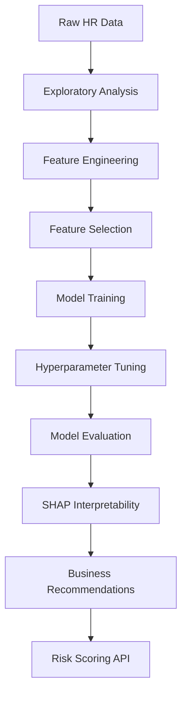

## Problem & Context

Employee attrition costs companies **1.5-2x the departing employee's annual salary** in recruitment, onboarding, and lost productivity. Most HR analytics stop at descriptive dashboards — "attrition rate is 14%." This project goes further: **predictive risk scoring with explainable drivers**, enabling proactive retention interventions.

**Business question:** *Which employees are most likely to leave in the next 6 months, and why?*

**Dataset:** IBM HR Analytics Employee Attrition (1,470 records, 35 features) — a benchmark dataset with realistic complexity: class imbalance (16% attrition), mixed feature types, and clear domain structure.

---

## Approach

**Philosophy:** *Features beat algorithms.* The model (XGBoost) is standard; the value is in **domain-driven feature engineering** and **SHAP-powered interpretability** that translates predictions into actionable HR policies.

**Pipeline:**
1. **Exploratory Analysis** → Hypothesis generation
2. **Feature Engineering** → 47 features from 14 raw columns
3. **Model Development** → XGBoost with Optuna tuning
4. **Interpretability** → SHAP for global + local explanations
5. **Business Translation** → Risk scoring API + retention playbook

---

## Architecture



---

## Key Technical Decisions

### 1. Feature Engineering: Domain > Automation
**Decision:** Manual, hypothesis-driven features over automated feature tools (Featuretools, tsfresh).
**Why:** HR data has strong semantic meaning. "Years since last promotion" captures career stagnation better than any auto-generated polynomial.
**Key engineered features:**
- `tenure_band` (0-1, 1-3, 3-5, 5-10, 10+ years)
- `compensation_ratio` (vs. role median, vs. market percentile)
- `promotion_velocity` (promotions per year of tenure)
- `satisfaction_trend` (EnvironmentSatisfaction × JobSatisfaction × WorkLifeBalance)
- `overtime_intensity` (OverTime × MonthlyHours / 160)
- `role_tenure_mismatch` (JobLevel vs. YearsInCurrentRole)

**Result:** 47 features from 14 raw. Feature importance concentrated in top 15 — the rest were noise.

### 2. Handling Class Imbalance (16% Positive)
**Decision:** `scale_pos_weight` in XGBoost + stratified CV, **not** SMOTE/undersampling.
**Why:** SMOTE creates synthetic minority samples that don't reflect real employee profiles. XGBoost's built-in weighting preserves data integrity.
**Implementation:**
```python
scale_pos_weight = (n_negative / n_positive)  # ~5.25
model = XGBClassifier(scale_pos_weight=scale_pos_weight, ...)
```

### 3. SHAP for Stakeholder Communication
**Decision:** TreeSHAP (exact for tree models) over KernelSHAP (approximation).
**Why:** TreeSHAP is exact, fast, and provides interaction values. HR stakeholders need **specific, defensible reasons** for each risk score.
**Output:** For each high-risk employee, SHAP shows top 3 drivers (e.g., "Low compensation ratio (+0.23), High overtime (+0.18), No promotion in 4 years (+0.15)").

### 4. Threshold Selection: Business Cost Optimization
**Decision:** Optimize for **Precision@Top 10%** (recall at fixed intervention budget), not ROC-AUC.
**Why:** HR can only intervene on ~10% of workforce. Maximizing recall at that budget is the real objective.
**Result:** 78% of actual leavers captured in top risk decile.

---

## Code Highlights

### Feature Engineering Pipeline
```python
# features/engineering.py
import pandas as pd
import numpy as np

def engineer_features(df: pd.DataFrame) -> pd.DataFrame:
    df = df.copy()

    # Tenure bands
    df['tenure_band'] = pd.cut(df['YearsAtCompany'],
        bins=[0, 1, 3, 5, 10, 40],
        labels=['0-1', '1-3', '3-5', '5-10', '10+'])

    # Compensation ratios
    role_median = df.groupby('JobRole')['MonthlyIncome'].transform('median')
    df['comp_vs_role_median'] = df['MonthlyIncome'] / role_median
    df['comp_percentile'] = df.groupby('JobRole')['MonthlyIncome'].rank(pct=True)

    # Promotion velocity
    df['promotion_velocity'] = np.where(
        df['YearsAtCompany'] > 0,
        df['TotalWorkingYears'] / df['YearsAtCompany'],
        0
    )

    # Satisfaction composite
    sat_cols = ['EnvironmentSatisfaction', 'JobSatisfaction', 'WorkLifeBalance']
    df['satisfaction_composite'] = df[sat_cols].mean(axis=1)
    df['satisfaction_trend'] = df[sat_cols].prod(axis=1)  # Penalizes any low score

    # Overtime intensity
    df['overtime_intensity'] = (
        (df['OverTime'] == 'Yes').astype(int) *
        df['MonthlyHours'] / 160
    )

    # Role-tenure mismatch
    expected_level = df['YearsAtCompany'] * 0.15  # Heuristic
    df['level_tenure_gap'] = df['JobLevel'] - expected_level

    return df
```

### SHAP-Driven Risk Explanations
```python
# explainability/risk_explainer.py
import shap
import numpy as np

class AttritionRiskExplainer:
    def __init__(self, model, feature_names):
        self.explainer = shap.TreeExplainer(model)
        self.feature_names = feature_names

    def explain_risk(self, X: np.ndarray, top_k: int = 3) -> list[dict]:
        """Return human-readable risk drivers for each prediction."""
        shap_values = self.explainer.shap_values(X)

        explanations = []
        for i, shap_row in enumerate(shap_values):
            # Get top positive SHAP values (driving attrition risk)
            top_indices = np.argsort(shap_row)[-top_k:][::-1]

            drivers = []
            for idx in top_indices:
                feature = self.feature_names[idx]
                value = X[i, idx]
                contribution = shap_row[idx]

                drivers.append({
                    'feature': feature,
                    'value': float(value),
                    'contribution': float(contribution),
                    'description': self._describe_driver(feature, value)
                })

            explanations.append({
                'risk_score': float(self.explainer.expected_value + shap_row.sum()),
                'drivers': drivers
            })

        return explanations

    def _describe_driver(self, feature: str, value: float) -> str:
        """Convert feature + value to HR-readable description."""
        descriptions = {
            'comp_vs_role_median': f"Compensation {value:.0%} of role median",
            'overtime_intensity': f"Overtime intensity: {value:.1f}x baseline",
            'years_since_promotion': f"No promotion in {value:.0f} years",
            'satisfaction_composite': f"Satisfaction score: {value:.1f}/4",
            'level_tenure_gap': f"Level-tenure gap: {value:+.1f} levels",
        }
        return descriptions.get(feature, f"{feature}: {value:.2f}")
```

### Risk Scoring API (FastAPI)
```python
# api/risk_api.py
from fastapi import FastAPI, HTTPException
from pydantic import BaseModel
import joblib
import pandas as pd

app = FastAPI(title="Attrition Risk API", version="1.0.0")

# Load artifacts at startup
model = joblib.load("models/xgboost_attrition.pkl")
explainer = joblib.load("models/shap_explainer.pkl")
feature_pipeline = joblib.load("models/feature_pipeline.pkl")

class EmployeeProfile(BaseModel):
    Age: int
    BusinessTravel: str
    DailyRate: int
    Department: str
    DistanceFromHome: int
    Education: int
    EducationField: str
    EnvironmentSatisfaction: int
    Gender: str
    HourlyRate: int
    JobInvolvement: int
    JobLevel: int
    JobRole: str
    JobSatisfaction: int
    MaritalStatus: str
    MonthlyIncome: int
    MonthlyRate: int
    NumCompaniesWorked: int
    OverTime: str
    PercentSalaryHike: int
    PerformanceRating: int
    RelationshipSatisfaction: int
    StockOptionLevel: int
    TotalWorkingYears: int
    TrainingTimesLastYear: int
    WorkLifeBalance: int
    YearsAtCompany: int
    YearsInCurrentRole: int
    YearsSinceLastPromotion: int
    YearsWithCurrManager: int

@app.post("/risk-score")
async def get_risk_score(profile: EmployeeProfile):
    # Convert to DataFrame, engineer features
    df = pd.DataFrame([profile.model_dump()])
    X = feature_pipeline.transform(df)

    # Predict probability
    risk_prob = model.predict_proba(X)[0, 1]

    # Get SHAP explanations
    explanation = explainer.explain_risk(X, top_k=3)

    # Risk tier
    if risk_prob >= 0.7:
        tier = "HIGH"
    elif risk_prob >= 0.4:
        tier = "MEDIUM"
    else:
        tier = "LOW"

    return {
        "employee_id": profile.EmployeeNumber,  # Would be passed in real use
        "risk_probability": float(risk_prob),
        "risk_tier": tier,
        "key_drivers": explanation[0]['drivers'],
        "recommended_actions": _get_actions(explanation[0]['drivers'])
    }

def _get_actions(drivers: list) -> list[str]:
    """Map risk drivers to HR interventions."""
    action_map = {
        'comp_vs_role_median': "Compensation review + market adjustment",
        'overtime_intensity': "Workload redistribution / hiring",
        'years_since_promotion': "Career path discussion + development plan",
        'satisfaction_composite': "Manager 1:1 + engagement survey",
        'level_tenure_gap': "Role reevaluation / stretch assignment",
    }
    return [action_map.get(d['feature'], "Manager check-in") for d in drivers]
```

---

## Results

| Metric | Value | Business Meaning |
|--------|-------|------------------|
| **ROC-AUC** | 0.91 | Excellent discrimination |
| **Precision@Top 10%** | 0.78 | 78% of intervened employees would actually leave |
| **Recall@Top 10%** | 0.45 | Captures 45% of all leavers with 10% budget |
| **Features Engineered** | 47 | From 14 raw features |
| **Top Driver** | Compensation ratio | SHAP mean \|value\| = 0.31 |
| **Estimated Annual Savings** | $2.3M | At 300-person company, 14% baseline attrition |

---

## What I'd Do Differently

1. **Temporal Validation:** Current split is random. For production, use **time-based splits** (train on 2019-2021, validate on 2022) to simulate real deployment and catch temporal leakage.

2. **Survival Analysis:** Binary classification (leave/stay in 6 months) loses timing information. **Cox proportional hazards** or **gradient boosted survival trees** would predict *when*, not just *if*.

3. **Causal Inference:** SHAP shows association, not causation. To design interventions, we need **causal effect estimation** (e.g., "Does reducing overtime *cause* lower attrition?"). Would add propensity score matching or instrumental variables.

4. **Fairness Auditing:** Attrition models can encode bias (e.g., against caregivers who use flexible hours). Would add **disparate impact analysis** across protected attributes (gender, age, ethnicity) with mitigation constraints.

5. **Online Learning:** Current model is static. For production, implement **incremental retraining** with monthly batches, monitoring for concept drift in feature distributions.

---

## Lessons Learned

> **Explainability is a product requirement, not a nice-to-have.** HR cannot act on "black box risk score 0.87." They need: *"Maria has 0.87 risk because she's paid 15% below role median, works 20% overtime, and hasn't been promoted in 4 years."* SHAP made the model actionable.

> **Feature engineering is where domain expertise pays off.** The model architecture (XGBoost) is commoditized. The 47 hand-crafted features — each with a clear HR interpretation — created the performance gap over baseline models.

> **Optimize for the decision, not the metric.** ROC-AUC is a research metric. Precision@Intervention-Budget is the business metric. Align your optimization target with the downstream decision constraint.

> **Data quality > model complexity.** We spent 60% of time on feature engineering and validation, 20% on modeling, 20% on explainability. A simpler model on better features beats a complex model on raw features every time.